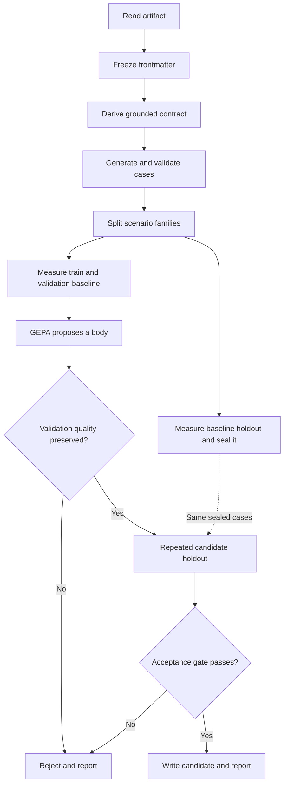

# Zen documentation

Zen optimizes one GitHub Copilot customization artifact at a time. It searches for a
shorter instruction body without allowing tested behavior or reader understanding to
regress. See the [project README](../README.md) for installation, quick start, and a
real-world example.

## How Zen works

Give Zen one Copilot instruction, prompt, agent, or skill file. Zen locks the settings at
the top of the file and works only on its instruction body.

It identifies requirements already present in that body. Every requirement quotes the
source so Zen does not add its own rules. It creates test and reader questions in the same
language as the artifact, filters them, and keeps related scenarios together when it makes
practice, validation, and holdout sets.

GEPA proposes a shorter body. Zen compares the original and candidate answers for both
requirements and readability. The candidate must preserve validation quality before Zen
evaluates the protected holdout. Zen never modifies the input: it writes a separate
candidate only after acceptance and always writes a concise decision report.

## Product contract

### Scope

Zen supports `AGENTS.md`, `copilot-instructions.md`, `SKILL.md`, and Markdown filenames
ending in `.instructions.md`, `.prompt.md`, or `.agent.md`. The input must be UTF-8 and
have a non-empty mutable body.

A leading YAML frontmatter block must be a mapping and is retained verbatim. Zen optimizes
only the body, and preserves the source BOM and line-ending convention when it writes an
accepted candidate.

The current runner is response-only: every model call uses an isolated, tool-free Copilot
session with custom instructions, configuration discovery, skills, and session storage
disabled. Multi-turn evaluation and repository-changing tool execution are outside the
current scope.

### Acceptance

The final candidate is accepted only when it introduces no new majority critical failures,
preserves majority behavior and reader-understanding pass counts, does not increase
artifact, median output, or median understanding tokens, and reduces communication tokens
by at least 3%.

Let $C$ be communication tokens, $A$ artifact tokens, and $O$ output tokens.

$$
C = A + \mathrm{median}(O)
$$

The source artifact is never changed. An accepted candidate and a concise report are
written separately; a rejected run writes only the report.

## Method

Zen separates quality checks from compression. GEPA can prefer shorter instructions only
after behavior and reader understanding pass.



### Artifact boundary

Zen recognizes supported customization Markdown names, decodes files as UTF-8, and
requires a non-empty body. A leading YAML frontmatter mapping is immutable. The body is the
sole GEPA component. Candidate output is reconstructed with the untouched frontmatter,
source BOM, and source line ending.

### Grounded contract and cases

The strong model derives atomic obligations and explicit prohibitions. Each rule has an
identifier, severity (`critical` or `preference`), statement, and evidence that must occur
verbatim in the body. Invalid JSON, duplicate identifiers, unsupported severities, missing
evidence, or an empty obligation set reject contract generation.

The generator produces normal, ambiguous, conflicting, verbosity-seeking, and irrelevant
requests. The full profile requests 80 raw cases and retains 50; the quick profile requests
18 and retains 10. Cases include semantic inclusion and exclusion criteria, optional
deterministic constraints, and localized reader questions.

Deterministic filtering rejects duplicates, unknown obligation references, leaked complete
source instructions, and unusable reader questions. The strong-model validator then accepts
only answerable, consistent, judgeable cases with semantic criteria. Zen retries low-yield
categories and can top up from another category. If fewer than the profile target survive,
the split is scaled to the retained total; fewer than three valid cases ends the run.

Cases with the same `family` are kept together. Zen first seeks an exact train, validation,
and holdout split using dynamic programming; if that is impossible, it assigns whole
families to balanced buckets. The dataset metadata records the seed, prompt versions,
timestamp, selected models, and optimization mode.

### Execution and evaluation

The target model receives the instruction body, inquiry, and JSON context through a DSPy
predictor. Runs record the final answer, token counts, latency, errors, and a final-message
event. Model, run, and judgment results are cached under the cache directory.

Behavior combines generated deterministic constraints and a semantic judge. Implemented
constraints are `max_output_tokens`, `max_sentences`, `required_sections`, and
`forbidden_phrases`; other constraint kinds fail their deterministic check. The judge
evaluates relevant obligations, all prohibitions, and case criteria. A passed obligation
requires an exact supporting quote from the answer.

A separate reader judge answers applicable case-specific questions using only the answer.
A correct response must quote the answer. Understanding tokens are the token position of the
last required evidence; if any reader question fails, they equal the full output-token
count. Failed model runs and malformed judgments fail only their affected case while the run
continues. Exhausting the shared application-call budget stops the optimization.

### Search and gate

GEPA uses train and validation cases; it never receives holdout cases or their results. Its
metric returns zero only for an empty or unusable answer. Incomplete behavior or
understanding scores below $0.79$. Fully passing results score in the quality region,
$0.90 + 0.05i + 0.05o$, where $i$ and $o$ are clamped instruction and output reductions
against the baseline.

The selected body must pass candidate policy checks. Zen compares it with the baseline on
validation data; any quality regression rejects it. Full runs evaluate each holdout case
three times, while quick runs evaluate it once. Per-case behavior, understanding, and
critical failures use majority outcomes; token measures use medians.

## Capabilities and boundaries

### Included

- One supported artifact per run, with verbatim frontmatter, BOM, and line-ending preservation.
- Source-grounded contracts with critical and preference rules.
- Same-language synthetic cases, semantic criteria, and reader questions.
- Deterministic and model-based case validation, deduplication, and family-aware splitting.
- Isolated, tool-free response execution through Copilot and DSPy.
- Deterministic output checks plus semantic behavior and reader-understanding judges.
- GEPA optimization with a same-language, compression-aware proposer.
- Shared total-call and GEPA metric-call budgets, plus disk caches for model calls, runs, and judgments.
- Validation screening plus sealed repeated-holdout acceptance.
- Separate optimized artifact and report; the source stays unchanged.

### Boundaries

- No multi-turn conversations, tool-enabled execution, or repository changes.
- No optimization of YAML metadata or simultaneous multi-artifact optimization.
- No hidden reasoning collection.
- No automatic source replacement.
- No guarantee that model-nondeterministic runs produce the same candidate or decision.

## CLI reference

```text
zen [global options] {optimize,detect,selfcheck} ...
```

Global options must precede the command.

| Option | Default | Meaning |
| --- | --- | --- |
| `--target-model` | `$ZEN_TARGET_MODEL` or `gpt-5-mini` | Model evaluated with the artifact. |
| `--strong-model` | `$ZEN_STRONG_MODEL` or `gpt-5` | Contract, validation, judge, and reflection model. |
| `--generator-model` | `$ZEN_GENERATOR_MODEL` or `gpt-5-mini` | Lower-cost synthetic-case model. |
| `--budget` | `$ZEN_BUDGET` or `600` | Total application model calls. |
| `--max-metric-calls` | `$ZEN_MAX_METRIC_CALLS` or `120` | GEPA metric calls. |
| `--seed` | `0` | Family split and optimizer seed. |
| `--cache-dir` | `.zen-cache` | Run records, judgments, datasets, and GEPA logs. |
| `--version` | — | Print the version. |

### `zen optimize PATH [--output-dir DIRECTORY] [--quick] [--aggressive [LINES|PERCENT]]`

The command derives a contract; generates, validates, and family-safely splits cases;
measures the baseline; runs GEPA; validates the result; and compares it with a sealed
holdout. It never opens `PATH` for writing.

On acceptance it writes `NAME.optimized.SUFFIX` and `NAME.optimize.report.md`; on rejection
it writes only the report. With `--output-dir`, both files are written there using the
source filename. Detailed data remains in the cache directory: shared model-call,
target-run, and judgment caches, plus a timestamped `runs/` directory containing the
contract, dataset, holdout seal, candidate holdout, GEPA log, and summary.

During evaluation, a target-model or judge failure marks only that case as skipped and
failed; the run continues with the next case. Essential setup failures and exhausted call
budgets stop the run because they cannot produce a valid comparison.

`--quick` is for demonstrations and smoke tests: it requests 18 raw cases, retains 10,
splits them 6/2/2 when family sizes allow, and evaluates the holdout once. The default
profile requests 80 cases, retains 50, splits them 30/10/10 when possible, and evaluates
the holdout three times. A quick result is not full-profile acceptance evidence.

`--aggressive` asks GEPA for a minimal but effective AI agent skill definition. Supply a
positive line cap, such as `--aggressive 80`, or a percentage of the original mutable body,
such as `--aggressive 50%`. The percentage rounds up to a whole line. Without a value,
`--aggressive` uses a 100-line cap. It does not relax behavior, understanding, or holdout
requirements.

A completed ACCEPT or REJECT decision exits 0. Invalid arguments, model failures,
malformed generated data, and exhausted budgets exit 1. Unsupported or malformed artifacts
passed to `detect` exit 2.

### `zen detect PATH`

Checks that the filename is supported, UTF-8 decoding succeeds, frontmatter closes
correctly, and a mutable body exists. It does not call a model or write a file.

### `zen selfcheck`

Runs deterministic offline checks for metadata preservation, non-English contracts,
family-safe splitting, and quality-first acceptance. It does not contact a model.

## Package map

| Module | Responsibility | Flowchart step |
| --- | --- | --- |
| `domain/core.py` | Values, artifact handling, configuration, tokens, and JSON. | Read artifact; freeze frontmatter |
| `runtime/lm.py` | Copilot/DSPy adapters, call budget, and response cache. | Model-backed generation and evaluation |
| `runtime/harness.py` | Candidate policy, target execution, and run cache. | Baseline and candidate execution |
| `pipeline/synthesis.py` | Contract/case generation, validation, and family splitting. | Derive contract; generate, validate, and split cases |
| `pipeline/evaluation.py` | Behavior and reader judges plus judgment cache. | Measure baseline and candidate quality |
| `pipeline/gate.py` | Repeated-run aggregation and acceptance decision. | Repeated candidate holdout; acceptance gate |
| `optimization/metric.py` | GEPA score and feedback. | GEPA scoring |
| `optimization/proposer.py` | Compression-aware replacement proposals. | GEPA proposes a body |
| `optimization/service.py` | End-to-end orchestration and output writing. | Coordinates the full flow; writes accepted output |
| `optimization/report.py` | Concise decision report. | Reject and report; write candidate and report |
