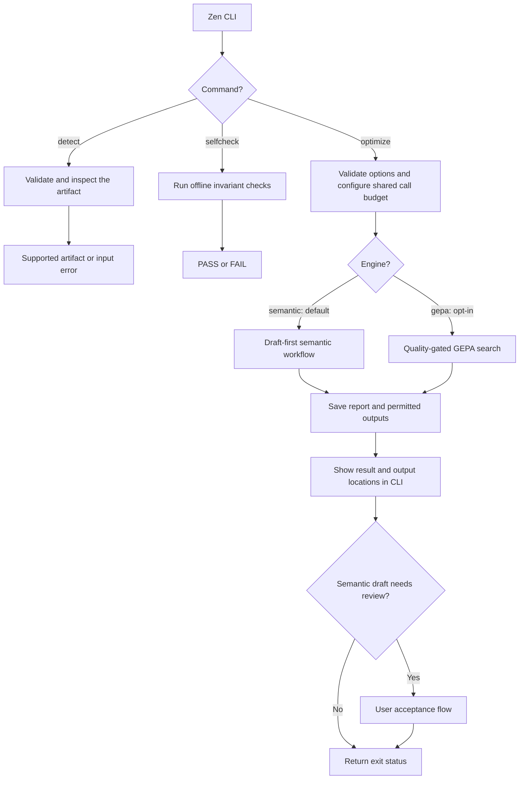
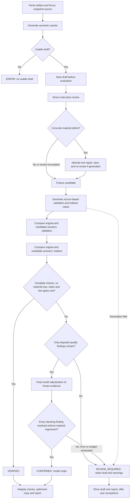
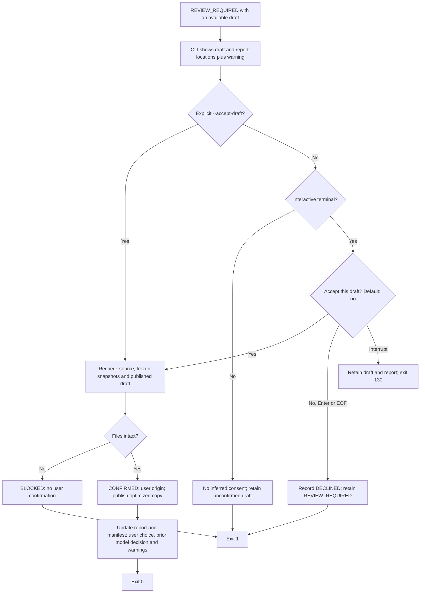
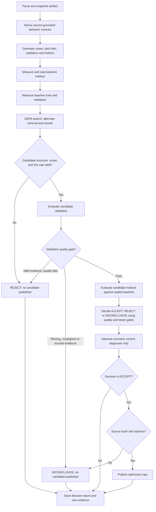

# Zen manual

Zen rewrites an entire GitHub Copilot instruction body more compactly, saves a draft,
and checks meaning with a bounded set of model calls. The default is the semantic
engine; GEPA search is available explicitly. "Dataset-free" means no user-supplied labeled dataset is needed:
Zen generates its own evaluation cases. See [README.md](../README.md#install-and-verify)
for installation, Copilot runtime setup, and authentication.

## Supported input

Each run accepts one UTF-8 Markdown artifact with a nonempty instruction body.
Supported filenames are case-insensitive: [AGENTS.md](../AGENTS.md),
`copilot-instructions.md`, `SKILL.md`, and names ending in `.instructions.md`,
`.prompt.md`, or `.agent.md`.

A leading YAML frontmatter block must be empty or a mapping. It is retained verbatim,
not optimized or used to configure execution. Candidate serialization preserves the
source BOM and detected LF/CRLF convention. Only the body can be rewritten.

Every model call uses an isolated, tool-free Copilot session with custom instructions,
configuration discovery, skills, and session storage disabled. The target receives the
body, inquiry, and context. Zen tests final answer text, not the
artifact's tools, scripts, linked files, or executable workflow.

## Application flow

The CLI routes inspection and offline checks without model calls. Optimization
selects one engine; both keep the source unchanged and use tool-free model sessions.

Human-readable reports show decisions, evidence, measurements and output availability,
not filesystem paths. The CLI and machine-readable manifests/run records retain
locations for retrieval and debugging. Setup or filesystem failures can prevent
report creation; initialized runs preserve failure evidence where possible.

## Commands and defaults

`zen [global options] optimize PATH [optimization options]` runs optimization.
`zen [global options] detect PATH` inspects input; `zen [global options] selfcheck` runs offline checks.

Global options must precede the command. The three model roles may use the same model.

| Global option | Default | Purpose |
| --- | --- | --- |
| `--target-model` | `ZEN_TARGET_MODEL` or `gpt-5.6-terra` | Produces answers being evaluated. |
| `--strong-model` | `ZEN_STRONG_MODEL` or `gpt-5.6-sol` | Rewrites instructions and judges meaning; GEPA also uses it for contracts and reader grading. |
| `--generator-model` | `ZEN_GENERATOR_MODEL` or `gpt-5.6-luna` | Generates synthetic cases. |
| `--budget` | Engine-dependent unless `ZEN_BUDGET` is set | Shared total application model-call limit; semantic default 32. |
| `--max-metric-calls` | `ZEN_MAX_METRIC_CALLS` or `120` | GEPA-only metric-call limit. |
| `--seed` | `0` | Dataset split and optimizer seed. |
| `--cache-dir` | `.zen-cache` | Response caches, trial records, and run data. |
| `--version` | — | Prints the version and exits. |
| `--help` | — | Prints command usage. |

Call budgets count application calls, not money or tokens. The semantic engine has
separate bounds on correction and structured-response retry work. Budget exhaustion
does not discard an already saved draft or turn incomplete checks into passes.

### Optimization options

| Option | Behavior |
| --- | --- |
| `--engine {semantic,gepa}` | Selects the default semantic workflow or opt-in GEPA search. |
| `--output-dir DIRECTORY` | Writes report and draft/candidate there; default is beside the source. |
| `--quick` | Uses the engine's smaller evaluation profile. |
| `--accept-draft` | Semantic only: explicitly accepts a REVIEW_REQUIRED draft as CONFIRMED by user, keeping the earlier model assessment and warnings in the report. No extra model calls. |
| `--aggressive [LINES\|PERCENT]` | Requests a body line cap; semantic has no default hard cap, GEPA defaults to 50%. |
| `--no-aggressive` | Disables the line cap. |
| `--focus {all,task,communication}` | Restricts mutations to the chosen explicit region; default `all`. |
| `--compare-concision` | GEPA only: adds a post-holdout diagnostic control, never a selectable candidate. |

In GEPA mode, aggressive mode is enabled by default with a cap of 50% of the original body lines,
rounded up. `--aggressive` alone uses the same percentage; `--no-aggressive` disables
the cap. For example, 101 original lines permit 51 lines, and 400 permit 200.
An explicit integer line cap must be positive;
a percentage must be greater than 0 and at most 100%, rounded up against the original
body's line count. For example, `--aggressive 80` or `--aggressive 50%`.
The cap applies to the entire body even with a scoped focus; it does not establish semantic quality.

The following larger dataset profiles apply to **GEPA only**:

| Profile | Initial raw target | Retained target | Train / validation / holdout | Holdout trials per case, per arm |
| --- | ---: | ---: | --- | ---: |
| Full (default) | 80 | 50 | 30 / 10 / 10 | 3 |
| Quick | 18 | 10 | 6 / 2 / 2 | 1 |

Generation retries and top-ups can request more raw cases. Retained totals may be
smaller; splits scale accordingly and keep declared families intact, so bucket sizes
can differ. Fewer than three usable cases ends evaluation. Quick mode is illustrative,
not full-profile acceptance evidence.

`detect PATH` checks filename support, UTF-8, frontmatter, and body without calling a
model or writing files. It does not validate a scoped focus or execute an artifact.
`selfcheck` runs offline invariants for metadata preservation, non-English contracts,
family-safe splitting, and quality-first acceptance.

## Scoped editing

`--focus task` requires exactly one `<!-- zen:task -->` / `<!-- /zen:task -->` pair.
`--focus communication` requires exactly one
`<!-- zen:communication -->` / `<!-- /zen:communication -->` pair.

Only text between the selected markers can change. The markers and all outside text
are frozen. The other pair is optional; in scoped mode all reserved Zen markers must
be exact, unique, paired, and non-nested. Invalid boundaries fail before evaluation.
`--focus all` makes the whole body mutable and does not interpret marker syntax.
There is no automatic semantic partition; focus limits edits, not the evaluation contract.

## Semantic optimization (default)

### What compression means

The rewrite model receives the complete original body, not a list of lines to delete.
It is asked to consolidate repetition and reorganize the instructions while preserving
required behavior, prohibitions, conditions, exceptions, priorities, language, and
explicit public output requirements. Concision is not permission to remove a difficult
requirement. Impossible tool or internal-reasoning demands cannot be verified through
a response-only experiment.

### Bounded workflow

1. Parse the artifact, validate the requested focus, record the source-byte hash,
   and initialize run records.
2. Generate a whole-body semantic rewrite and save a structurally valid draft
   before spending calls on evaluation. The original is never replaced.
3. Review source and draft for concrete meaning changes. At most one repair addresses
   material instruction-review findings, followed by re-review; no score-search loop.
4. Generate four source-based cases with `--quick`, or six normally, with equal
   validation and holdout groups and representative/boundary tasks in each.
5. Obtain original/candidate answers and compare their task-relevant meaning.
   The candidate is frozen before holdout; holdout findings cannot train repairs.
6. For complete but disputed evidence that meets the deterministic gates, run one
   final adjudication of the frozen source, draft, and both phases. Resolve every
   blocking finding without rewriting the draft or running more target cases.
7. Save the final report with verification status, remaining differences, errors,
   token measurements, and output availability. Locations belong in the CLI and manifest.
8. If a REVIEW_REQUIRED draft is available, the interactive CLI asks whether to
   accept it. Yes sets CONFIRMED with user origin, publishes an optimized copy and
   updates the report and manifest. No or Enter retains the unconfirmed draft.

### Semantic application flow

The semantic flow separates generating text from verifying it. Once the draft is
frozen, neither validation nor holdout findings can trigger another rewrite.

Incomplete reviews, failed task/judge calls and exhausted budgets remain missing
evidence, never passes. Every publication checks source integrity; changed source
or frozen candidate files block publication regardless of the displayed model outcome.

### Call budget and saved outputs

Each structured request allows one schema retry; provider errors are never retried.
Without retries or a repair, quick mode uses 15 calls and normal mode uses 21;
one repair plus re-review adds two. Eligible disputed runs add one final-review call,
with at most one schema retry. Passing runs do not need final adjudication. All of
these calls share the default ceiling of 32 application calls,
not a promise about provider tokens, time, or cost.

Each draft is saved under a unique run/revision filename. A current
`*.optimize.manifest.json` and `*.optimize.report.md` are published before the first
review and refreshed at completion. Run-unique reports preserve older evidence.
`*.draft.md` means reviewable text; `*.optimized.md` is published for VERIFIED or CONFIRMED
(including explicit user confirmation). The filename alone does not establish model verification.
On later source changes, Zen revokes this run's unchanged external candidate files,
not another run's artifacts or user-edited outputs. Internal snapshots remain evidence.

### Semantic comparison

The reviewer compares actions, facts, constraints, exclusions, conditions, and task
completion, rather than demanding identical words or response lengths. A short answer
can be equivalent to a long one. Missing required facts or altered exceptions are
material differences; harmless wording, ordering, or elaboration differences are not.

Judgments include explanatory rationales. Exact answer substrings are not mandatory.
The evaluator does not invent a requirement for step-by-step thought narration,
verification announcements, or a significance paragraph for every task. If the source
explicitly requires a public format for that task, however, changing it is a real
instruction change and must not be silently excused as concision.

Baseline weaknesses and newly introduced regressions are distinguished. Generated
claims of running a tool or test are text, not execution evidence. Model comparisons
are limited observations, not proof that every future output will be equivalent.

### Results and failures

Verification and draft availability are separate. A draft with missing checks,
unresolved material differences, or insufficient measured reduction remains available for
manual review; it is not presented as a verified optimization. Instruction-level
review and task-level evaluation are both needed for verified status.

**Final adjudication** is a last, bounded strong-model review of an otherwise
eligible REVIEW_REQUIRED result. It sees the source, frozen draft, latest instruction
review, every case and both answers, and the raw findings. It does not use the token
savings as a reason to excuse a quality loss or send holdout findings to a repair.

It must classify every blocking finding as a candidate regression, shared baseline
defect, evaluator error, harmless difference, or unresolved uncertainty, with specific
rationale and references to the supplied evidence records. It also assesses instruction
preservation and every case in validation and holdout separately, including initial
passes. Missing or duplicate findings/cases, unknown references, or a confirmation
contradicting an unresolved regression invalidate the response.

**CONFIRMED with model origin** means this final model review resolved all initial flags without
material candidate losses and the deterministic gates still passed. It is distinct
from **VERIFIED**, where initial checks passed directly. A shared defect in both
answers can be non-regressive, but cannot excuse dropping a source instruction.
Real new losses and uncertainty remain REVIEW_REQUIRED. The report preserves the
initial decision, original findings, final classifications, and separate phase results;
it does not relabel earlier case records as passes.

Final review cannot override incomplete/error-containing or misaligned evidence,
source/draft changes, a non-smaller artifact, the requested line cap, or inadequate
combined holdout reduction. If its remaining call budget is exhausted or its model
response fails, the draft stays REVIEW_REQUIRED. No additional budget is allocated.
Same-environment runs provide a controlled comparison, not independent model judgments.
Model confirmation does not imply human approval, cross-environment testing, tool execution,
or universal correctness.

**CONFIRMED with user origin** means the user explicitly accepted an available draft,
even though model checks left it REVIEW_REQUIRED. The CLI asks
“Accept this draft and mark it CONFIRMED by user? [y/N]” after displaying the report
and draft paths. Only yes confirms; no, Enter or EOF does not. Non-interactive runs
never read redirected input as consent; `--accept-draft` explicitly authorizes this
choice for the current optimization run. An accepted run exits successfully;
unconfirmed REVIEW_REQUIRED runs still exit with status 1.

The report states “Confirmed by user” and preserves the model decision before user
choice, its reasons, unresolved findings, missing evidence and unmet token/line gates.
The summary and current manifest record the confirmation origin and timestamped
user choice, including the accepted candidate hash. This is approval to use the
draft, not a claim that failed model checks passed. It adds no model calls and
does not rewrite the draft. Source/frozen-file changes or missing drafts cannot be
accepted; edited output files are never overwritten. GEPA gates are unchanged.

### User acceptance flow

The acceptance flow records a human choice separately from the earlier model
assessment. Approval changes the overall status, not the recorded evaluation results.

Approval adds no model calls. Publication errors still fail the command; confirmation
cannot bypass an integrity failure or overwrite a user-edited output.

Structured-response retries and repairs are bounded by the shared call budget.
Exhausted or malformed evidence is recorded, not discarded to improve scores.
If initial generation fails there may be no draft, but initialized runs retain
failure diagnostics. Source changes prevent publication against the wrong version.
Write failures can prevent even a report from being saved.

Artifact and response tokens use local estimates, not provider billing.
Reduced input length can offset longer sample responses in the combined measurement;
the report should be read for both numbers, not as a guarantee of cheaper future use.
No independent human reader metric is claimed by the semantic engine.

## GEPA optimization (opt-in)

Run with `--engine gepa` to use the following search, evidence, and acceptance policy.
GEPA has a different output contract: it publishes only accepted candidates.

### Pipeline

1. **Parse and snapshot.** Separate immutable metadata, validate focus, and record
   the source-byte SHA-256 hash and experiment configuration.
2. **Derive a contract.** The strong model extracts atomic obligations and prohibitions
   with unique IDs, critical/preference severity, and exact source quotes. Invalid
   references or an empty obligation set fail contract generation.
3. **Generate and split cases.** Request normal, ambiguous, conflicting, verbose, and
   irrelevant inquiries in the artifact's language, with semantic criteria and reader
   questions. Deterministic checks reject duplicates, invalid references, complete-source
   leakage, and unusable reader questions; a model checks case usability. Declared
   scenario families remain together across train, validation, and holdout.
4. **Measure the original.** Evaluate and hash-seal baseline holdout results, then
   measure train and validation baselines. GEPA receives no holdout cases or results.
5. **Search with GEPA.** The local proposer alternates removal and rewrite. GEPA
   evaluates and selects candidates using train/validation feedback; fully passing
   cases score above partial cases. Aggregate search scores can still trade off cases.
6. **Screen the selected body.** Check nonempty text, token size, writing-system
   retention, optional line cap, and focus boundaries; then apply the quality checks
   below to fresh candidate validation results against the validation baseline.
7. **Measure holdout and publish.** Evaluate the candidate on the sealed holdout and
   apply the final gate. Optionally measure the diagnostic control, then verify the
   source hash before writing any accepted copy.

### GEPA application flow

GEPA uses train/validation feedback for search, then applies a separate holdout gate.
Holdout evidence and the optional control never feed candidate proposals.

Failures during contract generation, baseline measurement or search also produce
INCONCLUSIVE after run initialization. GEPA has no user-confirmation override.

Removal proposals delete whole lines, protecting outside-focus text, recognized fenced
code, and lines overlapping critical source quotes. Scoped rewrites also preserve
recognized fenced blocks verbatim. Fence detection is conservative, not a full Markdown
parser. Invalid local proposals return the current text; an oversized rewrite can get
one retry. The proposal audit records attempts and policy outcomes, not GEPA selection.

### What GEPA measures

**Behavior** combines deterministic constraints with semantic checks for applicable
obligations, all prohibitions, and every inclusion/exclusion criterion. Supported
constraints are `max_output_tokens`, `max_sentences`, `required_sections`, and
`forbidden_phrases`; unsupported kinds fail their check.

Judgments require exactly the expected IDs and JSON booleans. Presence passes and
forbidden-content violations require exact answer quotes; absence verdicts require
explicit rationales. Malformed or mismatched evidence is an evaluation error, not a
normal failed rule. These checks validate evidence structure, not model correctness.

**Reader understanding** uses two calls. A reader sees only the answer and questions,
and supplies actual responses with citations. A separate grader checks those responses
against criteria and case facts hidden from the reader, plus the original answer.
Correct grades require supporting answer evidence and a reader citation; the grader
is instructed not to repair an incorrect reader response.

Explicit uncertainty is citable: if the answer states that a fact is unknown, the
reader must cite that statement. Null evidence is reserved for unsupported responses;
those questions deterministically fail understanding and are not sent to the grader.
The grader cannot fill in a missing reader citation to award a correct grade. If all
reader citations are null, no grading call is needed. Fabricated or malformed citations
remain evaluation errors, not abstentions.

**Understanding tokens** measure the token position of the last grader-selected
supporting evidence. If any reader question fails, the measure uses the full output
token count. This is an answerability/evidence-position proxy, not human reading time.
Token counts use local `o200k_base` text tokenization, not provider billing or the
complete runtime context. Wall time and final-message events are recorded separately.

### GEPA acceptance and evidence

Comparisons require complete, aligned baseline and candidate evidence: expected cases,
unique trial ordinals, matching rule/question coverage, and no target/evaluator errors.
Missing, duplicate, mismatched, or errored evidence yields **INCONCLUSIVE**.

With valid evidence, the default quality gate requires:

- No observed candidate critical failure in any trial, even if the original failed.
- At most a **5 percentage-point absolute drop** relative to baseline, independently
  in overall behavior and reader trial pass rates. Each rate is the number of
  trial-level passed booleans divided by all expected valid trials, equally weighted
  by trial with aligned baseline/candidate coverage. This is not a relative 5% drop.
- At least one behavior pass and one reader pass per candidate case. They need not occur in the
  same trial, and **not every trial must pass**.

Per-case/rule/question pass counts and aggregate majority counts need not be
nondecreasing. For N aligned valid trials, the rate gate alone allows `floor(N/20)`
net lost passes independently for behavior and reader; critical and per-case floors
may be stricter.

Validation and holdout gates remain separate: never pool their evidence or rates.
Validation currently uses **one trial per case**, so the per-case floor requires
every candidate validation case to pass both behavior and reader, regardless of the
5pp tolerance or sample size. Quality-first GEPA scoring is unchanged; holdout data
and control results remain excluded from GEPA inputs.

The final holdout gate additionally requires non-increasing artifact tokens,
median output tokens, and median understanding tokens across holdout trials, plus at least **3%**
reduction in communication tokens:

$$
\text{communication tokens} = \text{artifact tokens} + \operatorname{median}(\text{output tokens})
$$

Artifact counts include frozen metadata. Output may stay unchanged if artifact savings
meet the threshold; individual outputs can grow. Passing trial ordinals need not
match baseline. Acceptance permits bounded observed quality loss; it guarantees
neither zero quality reduction nor future behavior.

Evaluation and GEPA bypass application response replay; DSPy response caching is off.
Target-run and judgment caches are trial-scoped, including run/evaluation identity and
rubric context, so replay represents the same trial, not fresh evidence for a new run.
Contract/case generation can use response replay. Fresh application calls do not prove
provider-cache bypass or independent samples. Error trials cannot earn token savings.

### GEPA optional diagnostic control

`--compare-concision` tests the original body plus this fixed English suffix:

> Be concise where compatible with all preceding instructions. Preserve the required
> language, facts, warnings, uncertainty, and completeness; omit only unnecessary repetition.

It uses the same holdout and repetition count, only after candidate holdout completes;
early policy/validation rejection skips it. The control is never selected or fed back
to GEPA. Control budget exhaustion records control `INCONCLUSIVE` without replacing the
completed candidate decision. This diagnostic alone does not establish GEPA's added value.

### GEPA outputs and exit status

Zen never modifies the source or automatically applies a candidate. Publication checks
the source-byte hash; changed/unavailable source or missing hash yields `INCONCLUSIVE`.

- `NAME.optimized.SUFFIX`: accepted copy only; a nonaccepted run removes any stale copy
  at that output path.
- `NAME.optimize.report.md`: decision, reasons, and available measurements.
- `.zen-cache/runs/<run-id>/`: experiment metadata, contract, dataset, holdout seal,
  evaluations, proposal audit, GEPA logs, summary, and optional control records as
  their stages complete. Shared response/trial/judgment caches sit under the cache root.

Reports label validation and holdout separately and show trial passes / total trials,
pass rates, and percentage-point changes. Majority-passing case counts are diagnostic,
not gate inputs. Serialized aggregates retain `behavior_passes` and
`understanding_passes` as majority-case counts and additionally expose `total_trials`,
`behavior_trial_passes`, `understanding_trial_passes`, `behavior_pass_rate`, and
`understanding_pass_rate` (fractions from 0 to 1). Invalid comparisons have null rates
and null holdout `communication_reduction` in the summary; raw trial records remain
available for diagnosis, not savings claims.

Small samples give coarse rates: fewer than 20 aligned trials permit no net lost
passes; 30 trials permit one (3.33pp), not two (6.67pp), per dimension before applying
the stricter case/critical floors. Displayed percentages are rounded, but the 5pp
gate uses exact counts. These observations are not statistical confidence or
calibrated human utility.

Target/judge failures mark affected cases errored while evaluation continues. After
valid input/focus and run-directory/experiment initialization, exceptions and budget
exhaustion produce an inconclusive report in normal CLI flow. Earlier setup failures,
cancellation, or output-write failure can leave no report.

| Exit | Meaning |
| ---: | --- |
| 0 | Completed `ACCEPT` or `REJECT`; successful detect/selfcheck. |
| 1 | `INCONCLUSIVE`, caught optimize setup/runtime failure, or failed selfcheck. |
| 2 | Argument-parser error or unsupported/malformed artifact passed to detect. |
| 130 | Keyboard interruption during optimization's handled execution. |

## Limits and development

Zen does not evaluate multi-turn conversations, tool execution, repository changes, or
multi-file packages. Source quotes do not prove complete requirements; generated cases
do not guarantee coverage or absence of cross-family paraphrases. Holdout hashing is
not filesystem access control. Shared model roles can produce correlated errors.
There is no human-comprehension proof, promised savings, or universal behavior guarantee.
See [UNCONFIRMED_ASSUMPTIONS.md](../UNCONFIRMED_ASSUMPTIONS.md) for the current limitations register.

Run `uv run pytest -q`, `uv run zen selfcheck`, and `uv run ruff check zen tests` from
the repository root. Offline fixtures and real GEPA integration with scripted models
verify mechanics, not live provider performance or human reading gains.

- [zen/cli.py](../zen/cli.py): commands, defaults, and exits.
- [zen/domain/core.py](../zen/domain/core.py): artifacts, configuration, values, and tokens.
- [zen/runtime/lm.py](../zen/runtime/lm.py) and [zen/runtime/harness.py](../zen/runtime/harness.py): isolated calls, budgets, target execution, and caches.
- [zen/pipeline/synthesis.py](../zen/pipeline/synthesis.py): contracts, cases, and family splits.
- [zen/pipeline/evaluation.py](../zen/pipeline/evaluation.py) and [zen/pipeline/gate.py](../zen/pipeline/gate.py): judgments, reader proxy, and acceptance.
- [zen/optimization/proposer.py](../zen/optimization/proposer.py) and [zen/optimization/metric.py](../zen/optimization/metric.py): mutations and GEPA feedback.
- [zen/optimization/service.py](../zen/optimization/service.py) and [zen/optimization/report.py](../zen/optimization/report.py): orchestration, publication, and reports.
